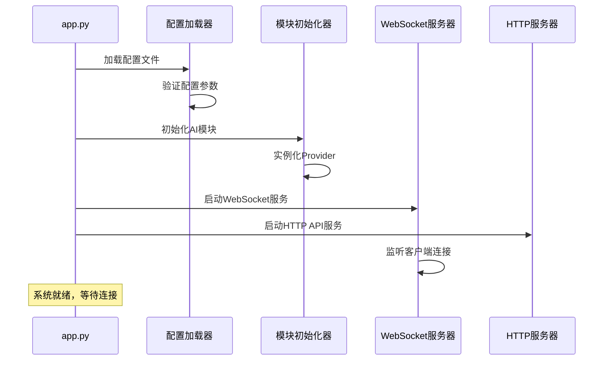
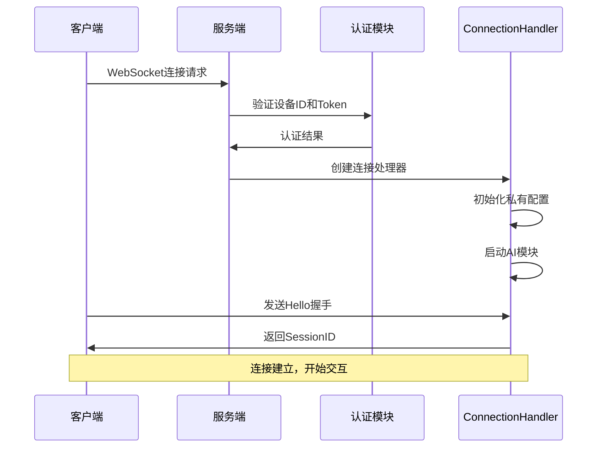
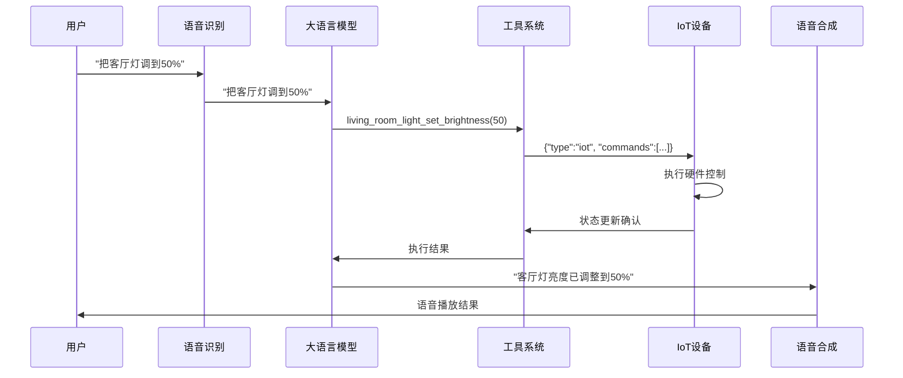
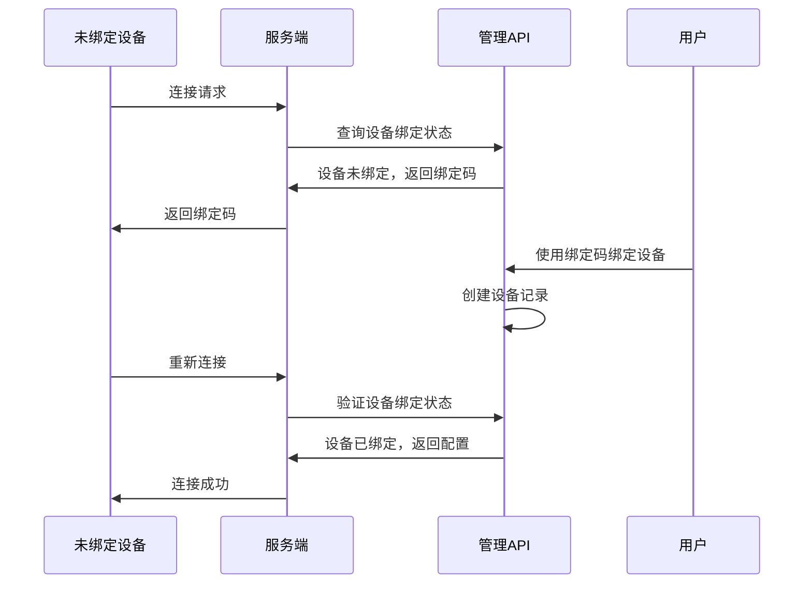

# 小智语音助手服务端系统架构说明文档

## 目录
1. [系统概述](#系统概述)
2. [架构设计](#架构设计)
3. [启动流程](#启动流程)
4. [模块封装](#模块封装)
5. [IoT控制系统](#iot控制系统)
6. [MCP协议支持](#mcp协议支持)
7. [工具生态系统](#工具生态系统)
8. [部署和配置](#部署和配置)

---

## 系统概述

小智语音助手服务端是一个基于AsyncIO的现代化语音交互系统，支持实时语音对话、智能设备控制和多模态AI交互。系统采用provider模式设计，支持多种AI服务提供商，具备高可扩展性和生产就绪的架构。

**生产级改造**: 项目正在进行从玩具级向企业级的全面改造，详细计划见[生产级改造计划.md](./生产级改造计划.md)。

### 核心特性
- **实时语音对话**: 支持语音识别(ASR)、语音合成(TTS)和大语言模型(LLM)
- **智能设备控制**: 支持IoT设备控制、HomeAssistant集成和MCP协议
- **多模态交互**: 支持文本、语音、图像等多种交互方式
- **插件化架构**: 支持动态加载插件和工具扩展
- **企业级部署**: 支持集群部署、监控和配置管理

---

## 架构设计

### 整体架构

```
┌─────────────────┐    ┌─────────────────┐    ┌─────────────────┐
│   客户端层      │    │   协议层        │    │   应用层        │
├─────────────────┤    ├─────────────────┤    ├─────────────────┤
│ ESP32设备       │◄──►│ WebSocket       │◄──►│ ConnectionHandler│
│ 移动端App       │    │ HTTP API        │    │ 会话管理        │
│ Web浏览器       │    │ MCP协议         │    │ 消息路由        │
└─────────────────┘    └─────────────────┘    └─────────────────┘
                                                       │
┌─────────────────────────────────────────────────────┼─────────────────────────────────────────────────────┐
│                                服务层                                                                    │
├─────────────────┬─────────────────┬─────────────────┬─────────────────┬─────────────────┬─────────────────┤
│   语音处理      │   AI核心        │   设备控制      │   工具系统      │   存储系统      │   配置管理      │
├─────────────────┼─────────────────┼─────────────────┼─────────────────┼─────────────────┼─────────────────┤
│ VAD语音检测     │ LLM大语言模型   │ IoT设备控制     │ 统一工具处理器  │ 对话记忆        │ 动态配置        │
│ ASR语音识别     │ Intent意图识别  │ HomeAssistant   │ 插件管理        │ 会话存储        │ 权限管理        │
│ TTS语音合成     │ Memory记忆管理  │ MCP客户端       │ Function Calling│ 文件存储        │ 设备绑定        │
└─────────────────┴─────────────────┴─────────────────┴─────────────────┴─────────────────┴─────────────────┘
```

### Provider模式设计

系统采用Provider模式实现AI服务的抽象化，支持多种服务提供商：

```python
# 核心Provider抽象
├── VAD (Voice Activity Detection)     # 语音活动检测
├── ASR (Automatic Speech Recognition) # 语音识别
├── LLM (Large Language Model)         # 大语言模型
├── TTS (Text To Speech)              # 语音合成
├── Memory                            # 记忆管理
├── Intent                            # 意图识别
├── Tools                             # 工具调用
└── VLLM (Vision Language Model)      # 视觉语言模型
```

**支持的服务提供商：**
- **LLM**: OpenAI GPT、Claude、通义千问、智谱AI、豆包、百度文心等
- **ASR**: 阿里云、腾讯云、Azure、本地Whisper等
- **TTS**: Edge-TTS、阿里云、腾讯云、本地XTTS等
- **VLLM**: OpenAI GPT-4V、Claude Vision、通义千问VL等

---

## 启动流程

### 系统启动序列



### 连接建立流程



---

## 模块封装

### Provider接口标准

每个AI服务都实现统一的Provider接口，确保可插拔性：

```python
# 以LLM Provider为例
class LLMProviderBase:
    def __init__(self, config):
        self.config = config
    
    def response(self, session_id, dialogue, **kwargs):
        """生成回复，返回可迭代对象支持流式输出"""
        raise NotImplementedError
    
    def response_with_functions(self, session_id, dialogue, functions=None):
        """支持函数调用的回复生成"""
        raise NotImplementedError
```

### 动态加载机制

系统支持运行时动态加载和切换Provider：

```python
# 模块初始化流程
def initialize_modules(logger, config, init_vad, init_asr, init_llm, init_tts, init_memory, init_intent):
    modules = {}
    
    # 根据配置选择具体的Provider实现
    if init_llm:
        llm_type = config["selected_module"]["LLM"]
        llm_config = config["LLM"][llm_type]
        modules["llm"] = llm_utils.create_instance(llm_type, llm_config)
    
    return modules
```

### 配置系统

支持多层次配置管理：

```yaml
# 全局配置 (config.yaml)
xiaozhi:
  version: 1
  transport: websocket
  audio_params:
    format: opus
    sample_rate: 16000

selected_module:
  LLM: "LLM_openai"
  ASR: "ASR_aliyun"
  TTS: "TTS_edge"

# 服务商配置
LLM:
  LLM_openai:
    api_key: "your-api-key"
    model: "gpt-4"
    base_url: "https://api.openai.com/v1"
```

---

## IoT控制系统

### IoT架构概述

IoT控制系统采用三层架构设计，支持多种设备集成方式：

```
设备层 ←→ 协议层 ←→ 应用层
ESP32     WebSocket   LLM+TTS
HA设备    REST API    工具调用
第三方    MCP协议     统一接口
```

### 设备能力声明机制

IoT设备通过描述符声明自己的能力，实现即插即用：

```json
{
  "name": "living_room_light",
  "description": "客厅智能灯",
  "properties": {
    "power": {"type": "boolean", "description": "电源状态"},
    "brightness": {"type": "number", "min": 0, "max": 100}
  },
  "methods": {
    "turn_on": {"description": "打开灯光"},
    "set_brightness": {"description": "设置亮度"}
  }
}
```

### 自动工具注册

服务端接收到设备描述符后，自动生成LLM函数调用工具：

```python
# 自动生成的工具
- get_living_room_light_power()      # 查询电源状态
- get_living_room_light_brightness() # 查询亮度
- living_room_light_turn_on()        # 打开灯光
- living_room_light_set_brightness() # 设置亮度
```

### 语音控制流程



### 支持的设备类型

| 设备类型 | 常用属性 | 常用方法 | 示例设备 |
|----------|----------|----------|----------|
| `light` | power, brightness, color | turn_on, turn_off, set_brightness | 智能灯泡、LED灯带 |
| `switch` | power | turn_on, turn_off | 智能开关、插座 |
| `sensor` | temperature, humidity, motion | get_reading | 温湿度传感器、人体感应器 |
| `curtain` | position, state | open, close, set_position | 智能窗帘、百叶窗 |
| `fan` | power, speed | turn_on, turn_off, set_speed | 智能风扇、吊扇 |
| `air_conditioner` | power, temperature, mode | set_temperature, set_mode | 空调、新风系统 |
| `robot_vacuum` | state, battery | start, stop, return_home | 扫地机器人 |
| `security` | armed, triggered | arm, disarm | 安防系统、门锁 |

### HomeAssistant集成

支持三种HomeAssistant集成方式：

#### 方式一：HA插件集成
通过function call插件直接调用HomeAssistant REST API：
```python
# 配置设备清单格式：位置,设备名,entity_id;
hass_devices = "客厅,智能灯,light.living_room_light;卧室,空调,climate.bedroom_ac;"
```

#### 方式二：HA语音助手
直接使用HomeAssistant的语音助手API：
```yaml
homeassistant:
  url: "http://192.168.1.100:8123"
  token: "your_long_lived_access_token"
  agent_id: "conversation.home_assistant"
```

#### 方式三：MCP协议集成（推荐）
通过MCP协议实现与HomeAssistant的无缝集成：
```json
{
  "mcpServers": {
    "Home Assistant": {
      "command": "mcp-proxy",
      "args": ["http://192.168.1.101:8123/mcp_server/sse"],
      "env": {"API_ACCESS_TOKEN": "your_token"}
    }
  }
}
```

---

## MCP协议支持

### MCP架构概述

该项目实现了企业级的MCP客户端系统，支持三种MCP模式：

```
xiaozhi-server (MCP客户端)
├── 设备端MCP     # 连接ESP32等设备上的MCP服务器
├── MCP接入点     # 连接外部第三方MCP服务器
└── 服务端MCP     # 管理本地MCP服务进程
```

### 设备端MCP

ESP32等设备运行MCP服务器，服务端作为客户端连接：

```python
# 设备端MCP调用示例
async def call_mcp_tool(conn, mcp_client, tool_name, args, timeout=30):
    payload = {
        "jsonrpc": "2.0",
        "id": tool_call_id,
        "method": "tools/call",
        "params": {"name": tool_name, "arguments": args}
    }
    await send_mcp_message(conn, payload)
```

**典型应用场景：**
- ESP32摄像头拍照
- GPIO控制
- 传感器数据读取
- 设备状态查询

### MCP接入点

连接外部第三方MCP服务器：

```yaml
# config.yaml
mcp_endpoint: ws://192.168.1.101:8123/mcp_server/sse
```

**支持的外部服务：**
- HomeAssistant MCP服务器
- 第三方AI工具服务
- 企业内部MCP服务

### 服务端MCP

管理本地MCP服务进程：

```json
// data/.mcp_server_settings.json
{
  "mcpServers": {
    "calculator": {
      "command": "python",
      "args": ["calculator.py"],
      "url": "ws://localhost:8080"
    },
    "weather": {
      "command": "node",
      "args": ["weather-service.js"],
      "env": {"API_KEY": "your_weather_api_key"}
    }
  }
}
```

### MCP协议特性

#### 标准协议支持
- **协议版本**: 2024-11-05
- **传输协议**: WebSocket + JSON-RPC 2.0
- **核心方法**: `tools/list`, `tools/call`, `initialize`

#### 视觉能力支持
```python
# MCP工具可以访问视觉分析接口
{
  "vision_url": "http://server:8003/mcp/vision/explain",
  "vision_token": "Bearer your-token"
}
```

#### 异步架构
- 所有MCP操作都是异步的，支持高并发
- 使用 `asyncio.Future` 处理工具调用的异步响应
- 支持工具调用超时和错误处理

---

## 工具生态系统

### 统一工具处理器

系统采用统一工具处理器架构，支持五种工具类型：

```python
class ToolType(Enum):
    SERVER_PLUGIN = "server_plugin"    # 服务端插件
    SERVER_MCP = "server_mcp"          # 服务端MCP
    DEVICE_IOT = "device_iot"          # 设备端IoT
    DEVICE_MCP = "device_mcp"          # 设备端MCP
    MCP_ENDPOINT = "mcp_endpoint"      # MCP接入点
```

### 工具注册机制

```python
class UnifiedToolHandler:
    async def _initialize(self):
        # 注册不同类型的执行器
        self.tool_manager.register_executor(ToolType.SERVER_PLUGIN, self.server_plugin_executor)
        self.tool_manager.register_executor(ToolType.DEVICE_IOT, self.device_iot_executor)
        self.tool_manager.register_executor(ToolType.DEVICE_MCP, self.device_mcp_executor)
        self.tool_manager.register_executor(ToolType.SERVER_MCP, self.server_mcp_executor)
        self.tool_manager.register_executor(ToolType.MCP_ENDPOINT, self.mcp_endpoint_executor)
```

### 插件系统

支持动态加载Python插件：

```python
# 插件注册示例
@register_function("weather_query", weather_function_desc, ToolType.SYSTEM_CTL)
def weather_query(conn, city="北京"):
    """查询天气信息"""
    # 实现天气查询逻辑
    return ActionResponse(action=Action.RESPONSE, response=f"{city}今天晴天")
```

### Function Calling集成

与LLM的Function Calling无缝集成：

```python
# LLM调用工具的流程
async def handle_llm_function_call(self, conn, function_call_data):
    function_name = function_call_data["name"]
    arguments = function_call_data["arguments"]
    
    # 通过工具管理器执行工具
    result = await self.tool_manager.execute_tool(function_name, arguments)
    
    # 处理执行结果
    if result.action == Action.RESPONSE:
        # 直接回复用户
        return result
    elif result.action == Action.REQLLM:
        # 需要LLM进一步处理
        return result
```

---

## 部署和配置

### 配置层次结构

```
配置系统
├── 全局配置 (config.yaml)          # 基础配置和默认值
├── 私有配置 (API动态获取)           # 设备专属配置
├── 插件配置 (plugins配置)          # 插件相关配置
├── MCP配置 (.mcp_server_settings.json) # MCP服务配置
└── 环境配置 (环境变量)             # 敏感信息配置
```

### 认证和权限

#### 多层认证机制
1. **设备ID认证**: 基于MAC地址的设备标识
2. **JWT Token认证**: 支持Bearer Token验证
3. **设备白名单**: 预配置的可信设备列表
4. **API密钥认证**: 用于HTTP API访问

#### 设备绑定流程


### 监控和日志

#### 结构化日志
```python
# 使用loguru进行结构化日志记录
self.logger.bind(tag="ConnectionHandler").info(
    f"设备连接: {self.device_id}, IP: {self.client_ip}"
)
```

#### 性能监控
- 连接数监控
- 工具调用延迟统计
- 错误率统计
- 资源使用监控

### 部署架构

#### 单机部署
```yaml
# docker-compose.yml
services:
  xiaozhi-server:
    image: xiaozhi-server:latest
    ports:
      - "8000:8000"  # WebSocket
      - "8003:8003"  # HTTP API
    volumes:
      - ./config:/app/config
      - ./data:/app/data
```

#### 集群部署
支持多实例负载均衡部署：
- WebSocket连接负载均衡
- 会话亲和性保持
- 配置中心化管理
- 服务发现和注册

### 扩展和定制

#### 添加新的Provider
1. 实现Provider基类接口
2. 在对应的utils模块注册
3. 更新配置文件
4. 重启服务生效

#### 开发自定义工具
1. 创建工具函数并注册
2. 定义工具描述和参数
3. 实现工具执行逻辑
4. 配置到对应的工具类型

#### MCP服务集成
1. 部署MCP服务器
2. 配置连接信息
3. 测试工具可用性
4. 监控服务状态

---

## 技术特色和优势

### 1. 现代化架构
- **异步编程**: 基于AsyncIO的高性能异步架构
- **事件驱动**: 响应式编程模型，支持实时交互
- **微服务友好**: 支持容器化部署和服务编排

### 2. 高可扩展性
- **插件化设计**: 支持动态加载和热更新
- **Provider模式**: 易于集成新的AI服务商
- **标准协议**: 支持MCP、WebSocket、REST等标准协议

### 3. 生产就绪
- **容错设计**: 完善的错误处理和降级机制
- **监控完备**: 全链路监控和日志记录
- **配置灵活**: 多层次配置管理，支持热更新

### 4. 开发友好
- **代码规范**: 遵循Python最佳实践
- **文档完善**: 详细的API文档和系统说明
- **测试覆盖**: 完整的单元测试和集成测试

该系统架构体现了现代AI应用开发的最佳实践，为构建可扩展、可维护的智能语音交互系统提供了优秀的参考实现。